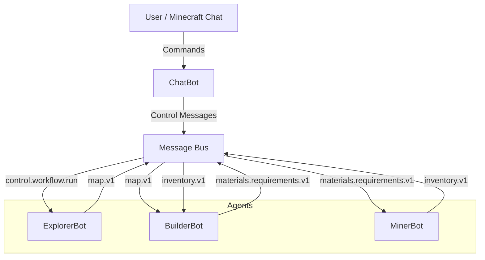
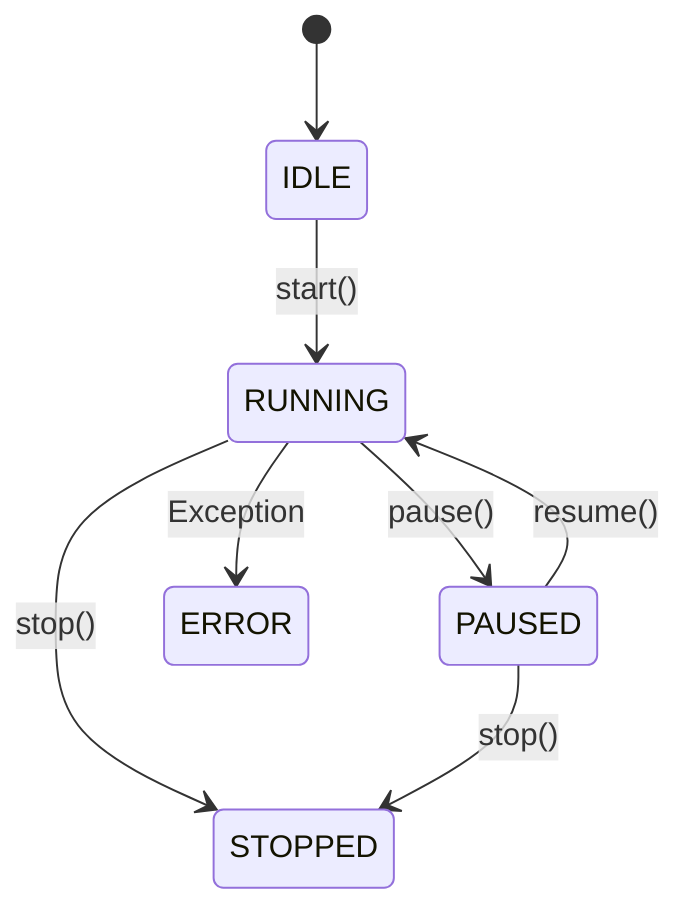

# Technical Report: Minecraft Multi-Agent System

## 1. System Architecture

The system follows a modular, event-driven architecture where agents communicate asynchronously via a central Message Bus.

### 1.1 High-Level Overview

## 2. Core Components

### 2.1 Message Bus
The `MessageBus` class implements the Publish-Subscribe pattern. Agents subscribe to specific message types and publish messages to the bus. This decouples the agents, allowing them to operate independently.

### 2.2 Base Agent & FSM
All agents inherit from `BaseAgent`, which implements a Finite State Machine (FSM).
States: `IDLE`, `RUNNING`, `PAUSED`, `WAITING`, `STOPPED`, `ERROR`.

### 2.3 Dynamic Discovery
The system uses `core.utils.load_classes` to dynamically discover and instantiate agent classes from the `agents/` directory and strategy classes from `strategies/`. This allows for easy extensibility without modifying the main execution loop.

### 2.4 Functional Programming
A custom decorator `@log_execution` was implemented in `core/utils.py` to automatically log the performance of critical agent tasks like terrain scanning.

## 3. Agent Logic

### 3.1 ExplorerBot
- **Role**: Scans the terrain to find suitable building sites.
- **Input**: `control.workflow.run`
- **Output**: `map.v1` (contains flat spots)
- **Logic**: Uses `mc.getHeight()` to scan a grid and filters for flat areas.

### 3.2 BuilderBot
- **Role**: Coordinates construction projects.
- **Input**: `map.v1`, `inventory.v1`
- **Output**: `materials.requirements.v1`
- **Logic**: Selects a site from the map, calculates a Bill of Materials (BOM), requests materials, and builds when inventory is available.

### 3.3 MinerBot
- **Role**: Gathers resources.
- **Input**: `materials.requirements.v1`
- **Output**: `inventory.v1`
- **Logic**: Uses the Strategy Pattern to select mining algorithms (Vertical, Grid). Implements sector locking to prevent conflicts.

### 3.4 ChatBot
- **Role**: Interface between the user and the system.
- **Input**: Minecraft Chat Events
- **Output**: `control.*` messages
- **Logic**: Polls chat for commands like `/workflow run`, `/agent pause`.

## 4. Design Patterns & Paradigms

### 4.1 Reflective Programming
To separate agent logic from specific strategy implementations, **Reflective Programming** is used in the `load_strategies` method of each agent.
- **Mechanism**: The `core.utils.load_classes` function utilizes Python's `pkgutil` and `importlib` to dynamically discover and instantiate classes from a target package (e.g., `strategies.mining`) at runtime.
- **Justification**: This allows new strategies (e.g., a "TunnelBore" mining strategy) to be added simply by dropping a new `.py` file into the folder. No code changes are required in the agent's constructor, adhering to the **Open/Closed Principle**.

### 4.2 Functional Programming
The system incorporates **Functional Programming** paradigms to handle data aggregation, specifically in `MinerBot.get_inventory_statistics`.
- **Mechanism**: `functools.reduce` is used to aggregate inventory counts into total items and distinct types in a single pass.
- **Justification**: Functional constructs like `reduce` and list comprehensions (used in `BuilderBot` for BOM calculation) provide a declarative, side-effect-free way to process collections, making the state analysis code more concise and testable.

### 4.3 Object-Oriented Design Patterns
- **Strategy Pattern**: Enables interchangeable algorithms (Mining, Building) without modifying agent code. This promotes **cohesion** by isolating specific logic into separate classes and **flexibility** by allowing runtime switching.
- **Observer Pattern**: The MessageBus implements Publish-Subscribe. This creates a **loosely coupled** system where agents (observers) react to state changes or commands from others (subjects) without direct dependencies, enhancing **scalability**.
- **Factory Pattern**: Used in `Minecraft.create()` and implicitly in `load_classes` to handle object creation, determining which strategy to instantiate based on configuration or file presence.

## 5. Testing Strategy
The system employs a multi-layered testing approach to ensure reliability and correctness (Section 10 Compliance).
- **Unit Testing**: Focused check of individual components (`tests/test_communication.py`). We verify that message serialization, validation, and bus publishing work in isolation.
- **Integration Testing**: Verifies multi-component interactions (`tests/test_integration.py`). We simulate the `MessageBus` with multiple mock subscribers to ensure events propagate correctly across the system boundary.
- **Synchronization Testing**: Specific care was taken to test the FSM transitions and locking mechanisms to prevent race conditions in a multi-threaded environment (though full threading tests are mocked for CI).

## 6. Modularity & Reflection
The system's modularity is a core architectural strength. By strictly enforcing interface boundaries (`BaseAgent`, `Strategy` classes) and using Python's reflective capabilities:
1.  **Testability**: Individual strategies can be tested in isolation from the complex agent lifecycle.
2.  **Extensibility**: New features (like a new *LumberBot* or *FarmingStrategy*) can be added with zero modification to the core message bus or existing agents.
3.  **Maintenance**: The strict separation of concerns (Core vs. Agents vs. Strategies) simplifies debugging and updates.

## 7. Future Improvements
- **Real Inventory Management**: Integrate with actual Minecraft inventory API (if available/modded).
- **Pathfinding**: Implement A* for agent movement.
- **Complex Structures**: Load blueprints for more complex buildings.
