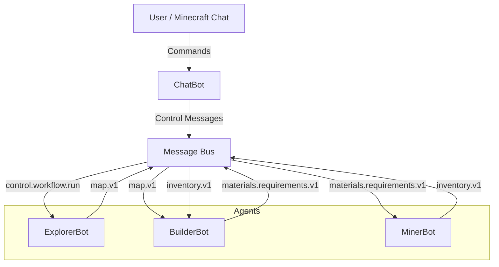
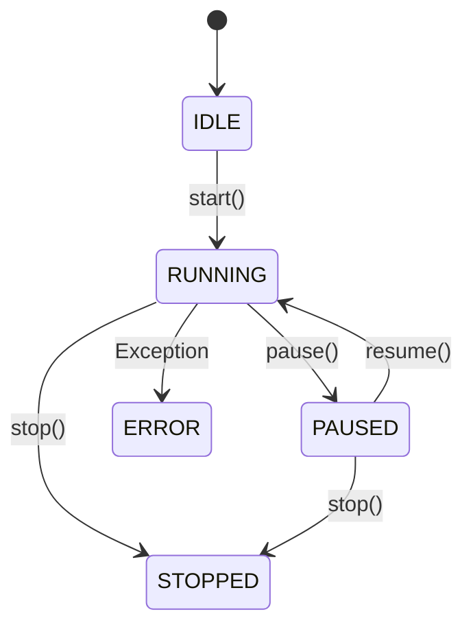

# Technical Report: Minecraft Multi-Agent System

## 1. System Architecture

The system follows a modular, event-driven architecture where agents communicate asynchronously via a central Message Bus.

### 1.1 High-Level Overview

## 2. Core Components

### 2.1 Message Bus
The `MessageBus` class implements the Publish-Subscribe pattern. Agents subscribe to specific message types and publish messages to the bus. This decouples the agents, allowing them to operate independently.

### 2.2 Base Agent & FSM
All agents inherit from `BaseAgent`, which implements a Finite State Machine (FSM).
States: `IDLE`, `RUNNING`, `PAUSED`, `WAITING`, `STOPPED`, `ERROR`.

### 2.3 Dynamic Discovery
The system uses `core.utils.load_classes` to dynamically discover and instantiate agent classes from the `agents/` directory and strategy classes from `strategies/`. This allows for easy extensibility without modifying the main execution loop.

## 3. Agent Logic

### 3.1 ExplorerBot
- **Role**: Scans the terrain to find suitable building sites.
- **Input**: `control.workflow.run`
- **Output**: `map.v1` (contains flat spots)
- **Logic**: Uses `mc.getHeight()` to scan a grid and filters for flat areas.

### 3.2 BuilderBot
- **Role**: Coordinates construction projects.
- **Input**: `map.v1`, `inventory.v1`
- **Output**: `materials.requirements.v1`
- **Logic**: Selects a site from the map, calculates a Bill of Materials (BOM), requests materials, and builds when inventory is available.

### 3.3 MinerBot
- **Role**: Gathers resources.
- **Input**: `materials.requirements.v1`
- **Output**: `inventory.v1`
- **Logic**: Uses the Strategy Pattern to select mining algorithms (Vertical, Grid). Implements sector locking to prevent conflicts.

### 3.4 ChatBot
- **Role**: Interface between the user and the system.
- **Input**: Minecraft Chat Events
- **Output**: `control.*` messages
- **Logic**: Polls chat for commands like `/workflow run`, `/agent pause`.

## 4. Future Improvements
- **Real Inventory Management**: Integrate with actual Minecraft inventory API (if available/modded).
- **Pathfinding**: Implement A* for agent movement.
- **Complex Structures**: Load blueprints for more complex buildings.
